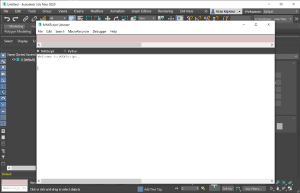
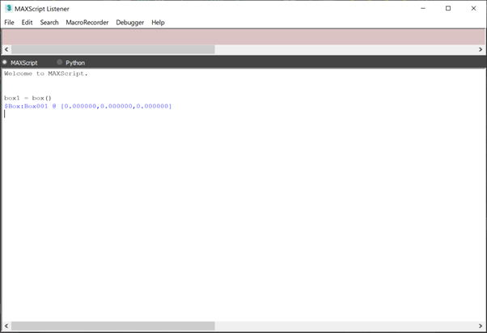
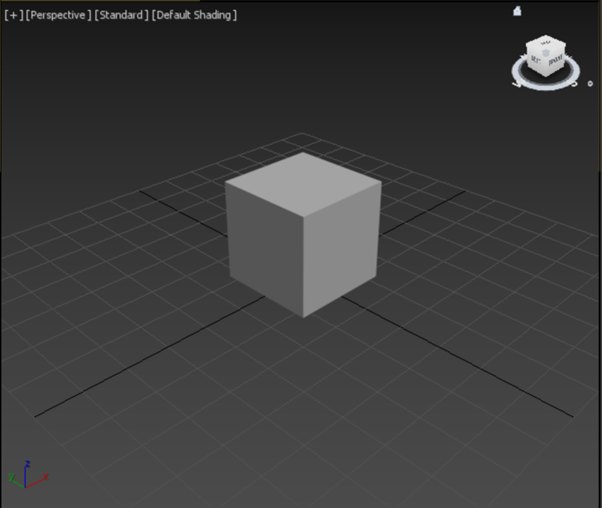
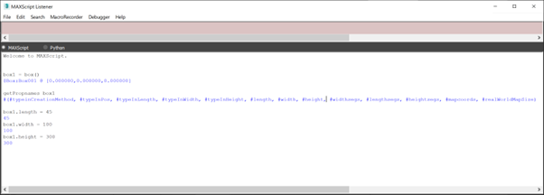
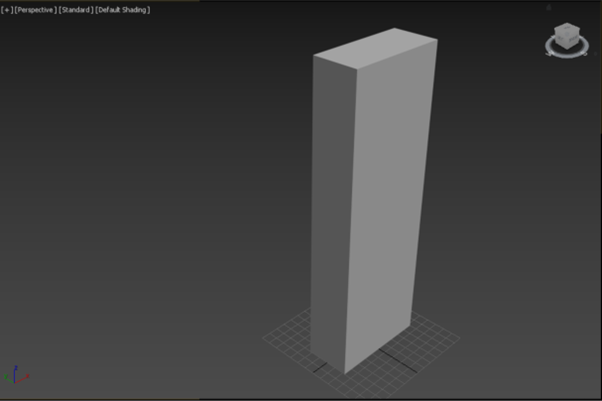
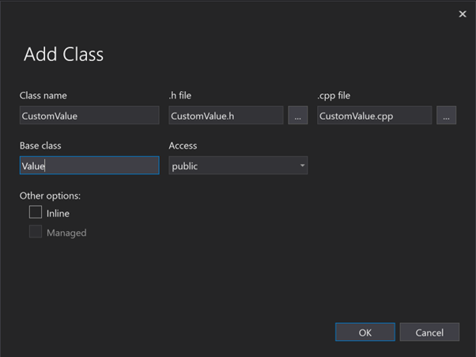

# Building a custom value type for MAXScript
**3ds MAX** is a is a professional 3D computer graphics program that can be used to create 3D animations, models, games, and images. The power that it can do comes not only from the robust UI (User Interface) tools and ease of building plugins but also from the inbuilt scripting capability using Autodesk MAXScript. It is no doubt the power that MAXScript adds to 3ds Max. It is a great scripting method for automation, animation, object creation and manipulation. Lately, it has become the core of initiating 3ds Max Design Automation in the Autodesk Platform Services (formerly Forge). 

## Object Manipulation using MAXScript
To manipulate objects in scene (create, modify, animate, etc.), the returned object on the Maxscript side must give you access to the underlying exposed properties. Let us create a simple box object and look at the exposed properties that the object has.

- Open 3ds MAX software and launch the Maxscript listener window (sample shown in the image below). To launch the listener window, check the steps outlined here [https://knowledge.autodesk.com/support/3ds-max/learn-explore/caas/CloudHelp/cloudhelp/2015/ENU/3DSMax/files/GUID-C8019A8A-207F-48A0-985E-18D47FAD8F36-htm.html](https://knowledge.autodesk.com/support/3ds-max/learn-explore/caas/CloudHelp/cloudhelp/2015/ENU/3DSMax/files/GUID-C8019A8A-207F-48A0-985E-18D47FAD8F36-htm.html).


- Let us create and add a box object to the scene. Add the command  ```box1 = box()```. 

    
    
    The command above creates a primitive type of box object with the name Box001 at x,y,z (0,0,0) as shown below.

    

- Let us begin by viewing all the exposed properties of the box object. We use the command ```getPropNames <object_name>``` i.e., ```getPropNames box1```. This returns a thorough list of properties **# (*#typeinCreationMethod, #typeInPos, #typeInLength, #typeInWidth, #typeInHeight, #length, #width, #height, #widthsegs, #lengthsegs, #heightsegs, #mapcoords, #realWorldMapSize*)**
- We can therefore manipulate the created scene object by changing the values of the associated properties. 
    ```python
    box1.length = 45
    box1.width = 100
    box1.height = 300
    ```
    

- Resultant object on scene is as shown below (notice changes in size as compared to the initial box object)
    


> As noted, each object type on the 3ds MAX does pose some properties that can be manipulated from the MAXScript side. A similar approach can be used to view properties for other objects like **Sphere**, **Cylinder**, **Cone**, etc.

# Making Custom Properties
Building your own custom objects may require you to set up your own custom properties exposed to the MAXScript. This is important as many a times we use primitive objects to build complex objects that we may need to access and manipulate from the MAXScript. As such, any data exposed to MAXScript from the C++ side inherits from the Value type. You can read more about how Value type work in MAXScript here [https://help.autodesk.com/view/MAXDEV/2023/ENU/?guid=GUID-911865D9-A5F9-4686-B01A-243308F41C55](https://help.autodesk.com/view/MAXDEV/2023/ENU/?guid=GUID-911865D9-A5F9-4686-B01A-243308F41C55). 

## Creating a Custom Value Type
- In your project, add a new class to your project, let us call it ```CustomValue```, inheriting the ```Value``` type as shown below.
    

- With that set, add the following snippets to your ```.h``` file
    ```c++
    #include <maxscript/maxscript.h>
    #include <maxscript/foundation/numbers.h>
    #include <maxscript/foundation/3dmath.h>

    #include "resource.h"

    #ifdef ScripterExport
    #undef ScripterExport
    #endif
    #define ScripterExport __declspec( dllexport )


    class CustomValue : public Value
    {
    public:
        ENABLE_STACK_ALLOCATE(CustomValue);

        void		collect() { delete this; }
        void		sprin1(CharStream* s);
        Value* get_property(Value** arg_list, int count);
        Value* set_property(Value** arg_list, int count);
        
        // Generic commands for copying/deleting/showing properties/etc.
        def_generic(delete, "delete");
        def_generic(copy, "copy");
        def_generic(show_props, "showProperties");
        def_generic(get_props, "getPropNames");
    };

    ```

- What do these functions do?
    - ```void sprin1(CharStream* s)``` – returns a string representation of the object. When instantiating the object from MAXScript, a string is returned showing the default or set values.
    - ```Value* get_property(Value** arg_list, int count)``` – Used to get property values into the MAXScript side. When a property is accessed from the MAXScript i.e., during computation, this function is called automatically, and it returns the current set value of the property.
    - ```Value* set_property(Value** arg_list, int count)``` – Similar to get_property, but in this case use to pass a new value from the MAXScript to the c++. Basically, used to update property values. It is also called automatically when assigning a value to a property. I.e., *box1.pos = [0.5,3.4,5.6]*
    - ```def_generic(get_props, "getPropNames")``` – Defines a generic property called ```getPropNames``` used in Maxscript to return all property names that can be accessed from MAXScript and maps it to an internal function in our class called ```get_props```.

With all declarations done, let's now implement the functionality before adding new property types to our class.
    ```c++
    Value* CustomValue::get_property(Value** arg_list, int count)
    {
        return Value::get_property(arg_list, count);
    }

    Value* CustomValue::set_property(Value** arg_list, int count)
    {
        return Value::set_property(arg_list, count);
    }

    Value* CustomValue::delete_vf(Value** arg_list, int count)
    {
        return &ok;
    }


    Value* CustomValue::copy_vf(Value** arg_list, int count)
    {
        return this;
    }

    void CustomValue::sprin1(CharStream* s)
    {
        // String reprentation of the data ie Point3Vales
    }

    Value* CustomValue::get_props_vf(Value** arg_list, int count)
    {
        // getPropNames <max_object> [#dynamicOnly] -- returns array of prop names of wrapped obj

        MAXScript_TLS* _tls = (MAXScript_TLS*)TlsGetValue(thread_locals_index);
        one_typed_value_local_tls(Array * result);
        vl.result = new Array(0);
        return_value_tls(vl.result);
    }

    Value* CustomValue::show_props_vf(Value** arg_list, int count)
    {
        // showProperties <max_object> [_T("prop_pat")] [to:<file>]   - applies to ref0 in the wrapper

        return &false_value;
    }

    ```
